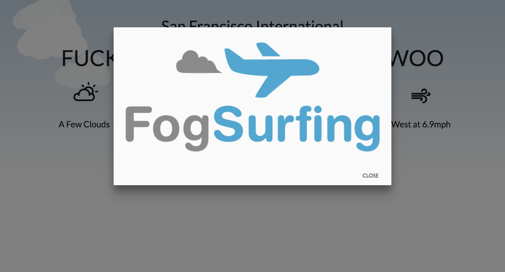

# fogsurfing.live
fogsurfing.live is a fictional domain name for a humorous SFO delay tracker. [FAA Web Services](https://services.faa.gov/) used for delay information, weather, temperature, and wind speeds. Submission for hackathon sponsored by name.com.

Event: Learn to Code: Hack the Dot SF

Date: June 18, 2016

Time spent: 2 hours

### [Live Preview](https://katsoohoo.github.io/HackTheDot2016/)

## Screenshots

